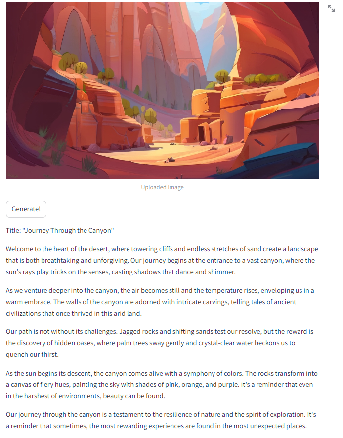

# Image to Blog
- Fun Project to Create a blog from an uploaded images using Gemini Pro Vision Model.  
- Upload an image and generate a mini blog using the generative model. 
#
- <b>Gemini Pro Vision + Streamlit</b>

#

# Startup 🚀
- Create a virtual environment: `conda create -p venv python==3.11.4 --y`
- Activate it: 
   - Windows: `conda activate {path_to_env}`
- Install packages: `pip install -r requirements.txt`
- Create an API_KEY for the model to run
- Start the app: `streamlit run main.py`

# Screenshots
<picture>
   
</picture>
<picture>
   
</picture>
   
<picture>
   
</picture>

<picture>
   
</picture>

<picture>
   
</picture>

#

# References

- <a href="https://deepmind.google/technologies/gemini/#introduction">Gemini</a> 
- <a href="https://streamlit.io/">Streamlit</a>
